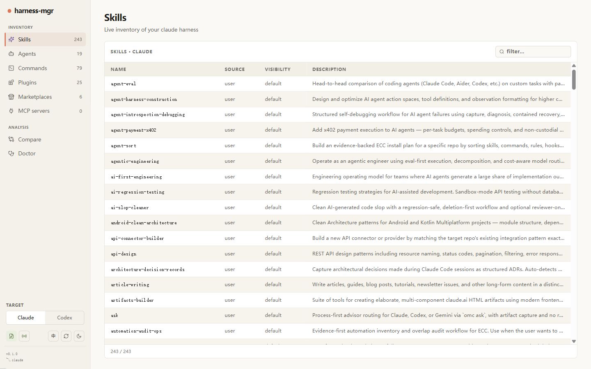
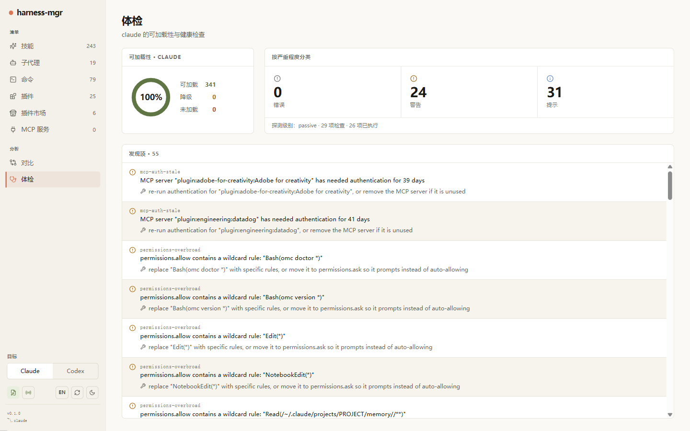

# Harness-MGR

[](https://github.com/YEowo-Y/harness-mgr/actions/workflows/ci.yml)
[](LICENSE)
[](.nvmrc)

**English** · [中文](README.zh-CN.md)

> A read-mostly, **dry-run-by-default** governance CLI for your Claude Code (`~/.claude`)
> and Codex (`~/.codex`) configuration — inventory, conflicts, effective-config, doctor,
> snapshot/rollback, and cross-target compare. Every write is gated, auto-snapshotted, and
> reversible.

<p align="center">
  
</p>

<p align="center"><sub><em>Read-only by default — and a <code>remove</code> that only <strong>previews</strong> until you pass <code>--apply</code> (auto-snapshotted, reversible).</em></sub></p>

## What it is

If you run a large Claude Code (or Codex) harness — dozens of skills, agents, commands,
plugins, and MCP servers — it gets hard to see what is actually installed, what shadows
what, and whether a change is safe. `harness-mgr` gives you that visibility, and lets you
make changes that are **auditable and reversible**.

It lives **outside** Claude Code's loader: it never participates in how Claude Code loads
components, and inspecting your config never changes it. The CLI core has **zero runtime
dependencies** (Node standard library only); the optional [MCP server](#mcp-server) adds a
single exact-pinned dependency.

## Key properties

- **Read-mostly** — every inspect command is pure and modifies nothing.
- **Dry-run by default** — write commands preview the change and exit without touching a
  file unless you pass `--apply`.
- **Reversible** — every governed write takes an automatic snapshot first, so `rollback`
  restores the affected files byte-for-byte.
- **Zero-network** — `harness-mgr`'s own code makes no network calls, enforced by a machine
  check (`selftest --boundary`).
- **Secret-safe** — sensitive settings values, token-shaped strings, and (opt-in) home-dir
  paths are redacted before they leave a command.

## Quickstart

Requires **Node ≥ 24**. The CLI core needs **no `npm install`** — clone and run:

```sh
git clone https://github.com/YEowo-Y/harness-mgr.git
cd harness-mgr
node src/cli.mjs doctor          # run a health check against ~/.claude
```

**One command, no clone** — install the `harness-mgr` command globally straight from GitHub (the repo is public, so no `npm publish` is needed), or run it once with `npx`:

```sh
npm install -g github:YEowo-Y/harness-mgr   # puts `harness-mgr` on your PATH
harness-mgr doctor
npx github:YEowo-Y/harness-mgr doctor       # …or run once, without installing
```

> Once the package is published to npm, this shortens to `npm install -g harness-mgr` / `npx harness-mgr`.

Pick whichever entry point you prefer — they all forward to the same core and work from any
directory:

| Entry point | How to get it | Example |
|-------------|---------------|---------|
| `harness-mgr` (on PATH) | `npm link` once in the repo | `harness-mgr inventory` |
| `./harness-mgr.sh` | macOS / Linux / WSL | `./harness-mgr.sh doctor` |
| `.\harness-mgr.ps1` | Windows PowerShell | `.\harness-mgr.ps1 conflicts` |
| `node src/cli.mjs` | anywhere with Node | `node src/cli.mjs health` |

The examples below use `harness-mgr` for brevity.

## Targets: Claude and Codex

`harness-mgr` governs two harnesses through one tool, one test suite, one safety net — not a
fork. The global `--target` flag selects which one:

```sh
harness-mgr inventory --target claude    # ~/.claude (default)
harness-mgr inventory --target codex     # ~/.codex
harness-mgr compare claude,codex         # what each harness has, side by side
```

Claude behaviour is identical whether or not Codex support is present; the Codex adapter is
descriptor-driven data over the same shared logic.

## Commands

Run `<command> --help` for every flag. The deeper rules live in
[`docs/`](docs/effective-config-rules.md).

**Inspect** (read-only):

| Command | What it shows |
|---------|---------------|
| `inventory` | Count and list skills / agents / commands / plugins / MCP servers |
| `conflicts` | Shadowing conflicts (same name loaded from multiple sources) + a resolution suggestion |
| `compare claude,codex` | Cross-target presence: what each harness has, by name and kind |
| `health` | One-shot "is anything wrong?" — loadability, best-practice advice, hook explanations |
| `doctor` | A suite of passive health checks (add `--active-probes` for a few opt-in active ones) |
| `orphans` | Files in the config dir that are not recognised config entries |
| `config show-effective` | The merged effective settings across all layers (secrets redacted) |
| `config diff <a> <b>` | A unified line-diff of two files (or two snapshots) |
| `hooks` / `permissions` | The merged hook order / the effective allow·ask·deny rules |
| `audit` / `drift` | The write audit log / changes since the last saved baseline |

**Snapshots** (archive the config tree under `.mgr-state/snapshots/`):

`snapshot` · `snapshot list` · `snapshot gc` · `snapshot pin` / `unpin`

**Governed writes** (dry-run by default; `--apply` to write; auto-snapshotted):

| Command | What it does |
|---------|--------------|
| `remove <kind>:<name>` | Delete an agent / command / skill |
| `disable` / `enable` | Flip an enable-state in config (Codex plugins/skills) |
| `skill visibility <name> <state>` | Set a Claude skill's visibility (`on` / `name-only` / `user-invocable-only` / `off`) |
| `skill propose` / `skill accept` | Draft a new `SKILL.md` as a proposal, then land it |
| `update <plugin>` | Delegate a plugin update to the external `claude` CLI |
| `mcp remove <name>` | Delegate an MCP-server removal to the external `claude` CLI |
| `rollback <id>` / `recover <id>` / `lock` | Restore a snapshot / reconcile an interrupted apply / inspect the apply lock |

Global flags on every command: `--format table|json|ndjson|quiet`, `--target claude|codex`,
`--config-dir <path>`, `--redact-paths`.

## Safety model

- **Dry-run + `--apply`.** A write needs `--apply` on the command line. Without it the
  command runs a read-only preflight and writes nothing, so a mistyped or copy-pasted command
  can't accidentally mutate your config.
- **Opt-out lock.** Set `HARNESS_MGR_ENABLE_WRITES=0` to hard-disable all governed writes
  (e.g. in CI); a locked write refuses with exit code `3` before the write machinery loads.
- **Auto-snapshot + rollback.** Before any governed write, the affected surface is archived
  to `.mgr-state/snapshots/<id>/` with per-file SHA-256 hashes. `rollback <id> --apply`
  verifies those hashes and restores byte-for-byte.
- **Zero-network.** The `update` and `mcp remove` commands delegate to the external `claude`
  CLI via a sandboxed spawn — any network activity belongs to that process, not to
  `harness-mgr`.

See [`docs/threat-model.md`](docs/threat-model.md) for the full model.

## MCP server

`harness-mgr` can expose its **read-only** view to Claude Code as a Model Context Protocol
server over **stdio**. It is a separate process (`node src/mcp/server.mjs`), not a CLI
subcommand, and exposes four read-only tools — `inventory`, `health`, `conflicts`, and
`doctor` (passive checks only) — each returning the same JSON envelope the CLI prints. Write
commands are **not** exposed; they stay behind the CLI's `--apply` gate.

The server speaks stdio pipes only — no network listener, no outbound connection. It is the
one place that needs the project's single runtime dependency, so run `npm install` once
first, then register it:

```sh
npm install
claude mcp add harness-mgr -- node /absolute/path/to/harness-mgr/src/mcp/server.mjs
```

## Optional front-ends

Two isolated front-ends wrap the same engine envelope; the root CLI stays zero-dependency.

- **`tui/`** — a terminal UI (Go + Bubble Tea).
- **`web/`** — a web UI (React + Vite + Hono): localhost-only, read-first, and bilingual (English · 中文).

Both read the live `~/.claude` / `~/.codex` and need Node on `PATH` (they shell out to the CLI engine). Launch either from the repo root:

```sh
# tui/ — terminal UI (needs Go); auto-resolves ../src/cli.mjs. Press ? for keys, q to quit.
cd tui && go run .

# web/ — web UI (needs Node + one npm install in web/):
cd web && npm install
npm run dev                  # dev + live-reload → http://127.0.0.1:5173 (API on :4319)
npm run build && npm start   # …or single-port production → http://127.0.0.1:4319
```

<p align="center">
  
  <br><sub><em><code>tui/</code> — the split-pane terminal browser (tab bar · counts · tree + detail)</em></sub>
</p>

<table>
  <tr>
    <td width="50%"></td>
    <td width="50%"></td>
  </tr>
  <tr>
    <td align="center"><sub><code>web/</code> — inventory dashboard (English UI)</sub></td>
    <td align="center"><sub><code>web/</code> — Doctor health checks (中文界面)</sub></td>
  </tr>
</table>

<sub><em>The web UI binds <code>127.0.0.1</code> only, surfaces the same read engine, and exposes only a frozen set of gated, reversible writes. Paths in every screenshot are redacted.</em></sub>

## Output formats

`table` (default, human-readable) · `json` (`{"version":1,…}` envelope) · `ndjson` (one
record per line, for streaming) · `quiet` (single-line error/warning counts). An unknown
value falls back to `table` with a warning.

## Exit codes

| Code | Meaning |
|------|---------|
| `0` | Ran cleanly — no error-severity diagnostics |
| `1` | Ran, but produced one or more error-severity diagnostics |
| `2` | Usage error, or a refused/invalid write target |
| `3` | A write was refused (write gate locked, missing spec, or `--force` required) |
| `4` | Snapshot integrity failure (archive hash mismatch) — write aborted |
| `6` | Apply lock could not be acquired (another apply may be running) |

## Project layout

| Path | Purpose |
|------|---------|
| `src/cli/` | Command handlers + render adapters |
| `src/analysis/` | Pure analysis (conflicts, compare, doctor checks, redaction) |
| `src/discovery/` | Never-throwing scanners (components, plugins, MCP, settings) |
| `src/ops/` | Gated write operations (snapshot, rollback, config-edit) |
| `src/lib/` | Shared primitives (diagnostics, paths, TOML/JSON editors) |
| `docs/` | User-facing reference (effective-config rules, threat model) |

## Contributing & license

Contributions welcome — see [CONTRIBUTING.md](CONTRIBUTING.md) and
[CODE_OF_CONDUCT.md](CODE_OF_CONDUCT.md). Run the test suite with `npm test` (Node ≥ 24).

Licensed under the [MIT License](LICENSE).

## Status

Stable. All read commands are safe to run at any time — they are pure and modify nothing.
Governed writes are gated by `--apply` (with a `HARNESS_MGR_ENABLE_WRITES=0` opt-out lock) and
are reversible via the auto-snapshot and `rollback`.
