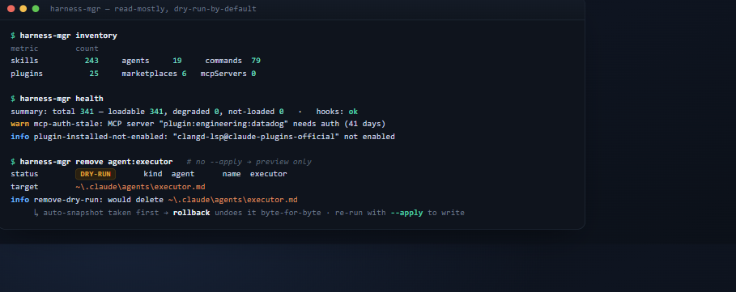
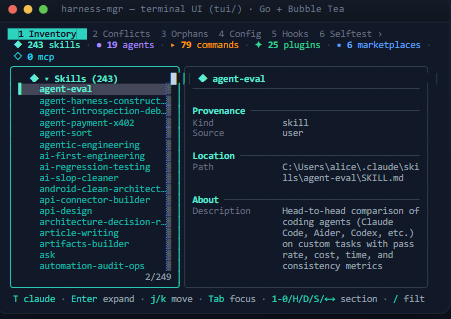
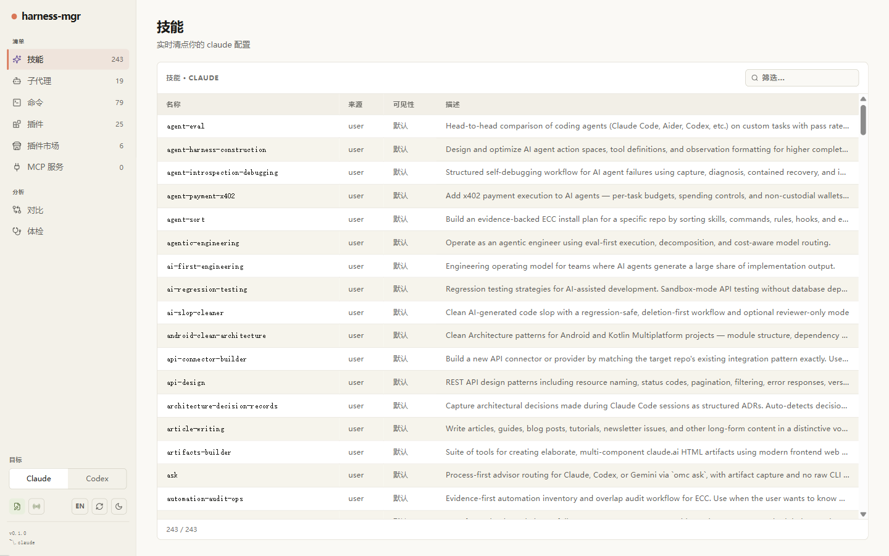
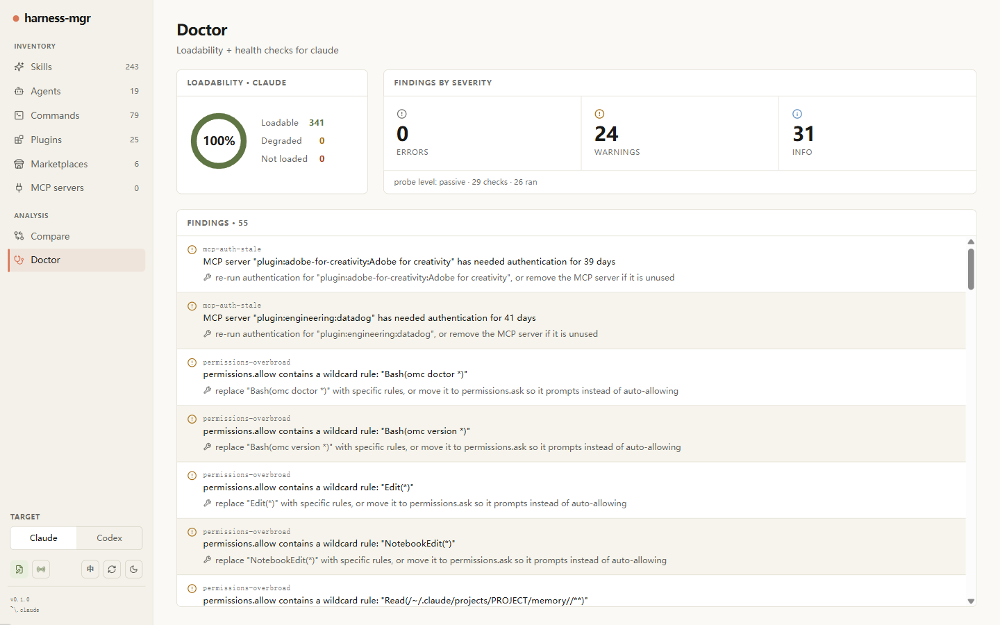

# Harness-MGR

[](https://github.com/YEowo-Y/harness-mgr/actions/workflows/ci.yml)
[](LICENSE)
[](.nvmrc)

[English](README.md) · **中文**

> 一个**默认只预览（dry-run）**、以只读为主的治理命令行工具，用来管理你的 Claude Code
> （`~/.claude`）和 Codex（`~/.codex`）配置——清点、冲突检测、生效配置、体检、
> 快照/回滚、跨目标对比。每一次写入都经过门控、自动快照、可回滚。

<p align="center">
  
</p>

<p align="center"><sub><em>默认只读——<code>remove</code> 也只<strong>预览</strong>，直到你加上 <code>--apply</code>（届时自动快照、可回滚）。</em></sub></p>

## 这是什么

如果你的 Claude Code（或 Codex）配置很大——几十个技能、代理、命令、插件、MCP 服务器——
就很难看清到底装了什么、谁遮蔽了谁、某个改动是否安全。`harness-mgr` 给你这种可见性，
并让你的改动**可审计、可回滚**。

它运行在 Claude Code 加载器**之外**：从不参与 Claude Code 如何加载组件，查看配置也绝不会
改动配置。CLI 核心**零运行时依赖**（只用 Node 标准库）；可选的 [MCP 服务器](#mcp-服务器)
才会引入唯一一个精确锁定版本的依赖。

## 核心特性

- **只读为主**——每个查看类命令都是纯函数，什么都不改。
- **默认只预览**——写入类命令会先预览改动并退出，只有加 `--apply` 才真正落盘。
- **可回滚**——每次受管写入前都会自动拍一份快照，`rollback` 能逐字节还原受影响的文件。
- **零网络**——`harness-mgr` 自身代码不发起任何网络请求，并由机器级检查强制保证
  （`selftest --boundary`）。
- **防泄密**——敏感设置值、形似令牌的字符串、以及（可选的）家目录路径，在离开命令前都会被打码。

## 快速上手

需要 **Node ≥ 24**。CLI 核心**无需 `npm install`**——克隆即用：

```sh
git clone https://github.com/YEowo-Y/harness-mgr.git
cd harness-mgr
node src/cli.mjs doctor          # 对 ~/.claude 跑一次体检
```

四个入口随你挑——它们都转发到同一个核心，且在任意目录下都能用：

| 入口 | 怎么获得 | 示例 |
|------|---------|------|
| `harness-mgr`（在 PATH 上） | 在仓库里执行一次 `npm link` | `harness-mgr inventory` |
| `./harness-mgr.sh` | macOS / Linux / WSL | `./harness-mgr.sh doctor` |
| `.\harness-mgr.ps1` | Windows PowerShell | `.\harness-mgr.ps1 conflicts` |
| `node src/cli.mjs` | 任何装了 Node 的地方 | `node src/cli.mjs health` |

下文示例为简洁起见统一用 `harness-mgr`。

## 两个目标：Claude 与 Codex

`harness-mgr` 用一套工具、一套测试、一张安全网治理两个 harness——不是分叉。全局
`--target` 选择治理哪一个：

```sh
harness-mgr inventory --target claude    # ~/.claude（默认）
harness-mgr inventory --target codex     # ~/.codex
harness-mgr compare claude,codex         # 两个 harness 各有什么，并排对比
```

无论是否启用 Codex 支持，Claude 的行为都完全一致；Codex 适配器是跑在同一套共享逻辑上的
描述符数据表。

## 命令

每个命令加 `--help` 看全部参数。更深的规则见 [`docs/`](docs/effective-config-rules.md)。

**查看**（只读）：

| 命令 | 看什么 |
|------|--------|
| `inventory` | 统计并列出 技能 / 代理 / 命令 / 插件 / MCP 服务器 |
| `conflicts` | 遮蔽冲突（同名从多个来源加载）+ 处置建议 |
| `compare claude,codex` | 跨目标存在性：两个 harness 各有什么，按名字和类别 |
| `health` | 一条命令汇总"有没有问题"——可加载性、最佳实践建议、钩子说明 |
| `doctor` | 一组被动健康检查（加 `--active-probes` 跑几项可选的主动探测） |
| `orphans` | 配置目录里不被识别为配置项的文件 |
| `config show-effective` | 合并后跨层的生效设置（敏感值已打码） |
| `config diff <a> <b>` | 两个文件（或两份快照）的统一行 diff |
| `hooks` / `permissions` | 合并后的钩子顺序 / 生效的 allow·ask·deny 规则 |
| `audit` / `drift` | 写入审计日志 / 相对上次基准的变化 |

**快照**（把配置树归档到 `.mgr-state/snapshots/`）：

`snapshot` · `snapshot list` · `snapshot gc` · `snapshot pin` / `unpin`

**受管写入**（默认只预览；加 `--apply` 才写；自动快照）：

| 命令 | 做什么 |
|------|--------|
| `remove <kind>:<name>` | 删除一个 代理 / 命令 / 技能 |
| `disable` / `enable` | 翻转配置里的启用状态（Codex 插件/技能） |
| `skill visibility <name> <state>` | 设置 Claude 技能的可见性（`on` / `name-only` / `user-invocable-only` / `off`） |
| `skill propose` / `skill accept` | 先把新 `SKILL.md` 写成提案，再落地 |
| `update <plugin>` | 把插件更新委托给外部 `claude` CLI |
| `mcp remove <name>` | 把 MCP 服务器移除委托给外部 `claude` CLI |
| `rollback <id>` / `recover <id>` / `lock` | 还原快照 / 处理被中断的写入 / 查看写入锁 |

每个命令都有的全局参数：`--format table|json|ndjson|quiet`、`--target claude|codex`、
`--config-dir <path>`、`--redact-paths`。

## 安全模型

- **只预览 + `--apply`。** 写入必须在命令行加 `--apply`。不加就只跑只读预检、什么都不写，
  所以打错字或复制粘贴的命令不会误改你的配置。
- **退出锁。** 设 `HARNESS_MGR_ENABLE_WRITES=0` 可硬性禁用所有受管写入（比如在 CI 里）；
  被锁住的写入会在加载写入机制之前就以退出码 `3` 拒绝。
- **自动快照 + 回滚。** 任何受管写入之前，受影响的范围会被归档到
  `.mgr-state/snapshots/<id>/`，并带每个文件的 SHA-256 哈希。`rollback <id> --apply`
  会先校验哈希再逐字节还原。
- **零网络。** `update` 和 `mcp remove` 通过沙箱化 spawn 委托给外部 `claude` CLI——
  网络行为（如果有）属于那个进程，不属于 `harness-mgr`。

完整威胁模型见 [`docs/threat-model.md`](docs/threat-model.md)。

## MCP 服务器

`harness-mgr` 可以把它的**只读**视图作为 Model Context Protocol 服务器、通过 **stdio**
暴露给 Claude Code。它是一个独立进程（`node src/mcp/server.mjs`），不是 CLI 子命令，
暴露四个只读工具——`inventory`、`health`、`conflicts`、`doctor`（仅被动检查）——
每个都返回和 CLI 一样的 JSON 信封。写入类命令**不**暴露，始终留在 CLI 的 `--apply` 门后。

服务器只走 stdio 管道——没有网络监听、没有外连。这是唯一需要那个运行时依赖的地方，
所以先跑一次 `npm install`，再注册：

```sh
npm install
claude mcp add harness-mgr -- node /你的仓库绝对路径/harness-mgr/src/mcp/server.mjs
```

## 可选前端

两个相互隔离的前端包裹同一套引擎信封；根 CLI 保持零依赖。

- **`tui/`**——终端界面（Go + Bubble Tea）。
- **`web/`**——网页界面（React + Vite + Hono）：仅本地、以只读为先、中英双语。

两者都读取实时的 `~/.claude` / `~/.codex`，且需要 `PATH` 上有 Node（它们会调用 CLI 引擎）。在仓库根目录任选其一启动：

```sh
# tui/ — 终端界面（需要 Go）；自动定位 ../src/cli.mjs。按 ? 看快捷键、q 退出。
cd tui && go run .

# web/ — 网页界面（需先跑一次 npm install）。打开 http://127.0.0.1:5173（API 在 :4319）。
cd web && npm install && npm run dev
```

<p align="center">
  
  <br><sub><em><code>tui/</code> — 分屏终端浏览器（标签栏 · 计数 · 树 + 详情）</em></sub>
</p>

<table>
  <tr>
    <td width="50%"></td>
    <td width="50%"></td>
  </tr>
  <tr>
    <td align="center"><sub><code>web/</code> — 清点面板（中文界面）</sub></td>
    <td align="center"><sub><code>web/</code> — Doctor 体检（English UI）</sub></td>
  </tr>
</table>

<sub><em>网页界面仅绑定 <code>127.0.0.1</code>（仅本地），复用同一套只读引擎，只暴露一组冻结的、门控且可回滚的写入。所有截图中的路径均已脱敏。</em></sub>

## 输出格式

`table`（默认，人类可读）· `json`（`{"version":1,…}` 信封）· `ndjson`（每行一条记录，
适合流式消费）· `quiet`（单行错误/警告计数）。无法识别的值会回退到 `table` 并给出警告。

## 退出码

| 码 | 含义 |
|----|------|
| `0` | 干净运行——无 error 级诊断 |
| `1` | 跑完了，但产生了一条或多条 error 级诊断 |
| `2` | 用法错误，或被拒绝/无效的写入目标 |
| `3` | 写入被拒（写入门被锁、缺少规格、或需要 `--force`） |
| `4` | 快照完整性失败（归档哈希不匹配）——写入中止 |
| `6` | 没拿到写入锁（可能有另一个写入在跑） |

## 项目结构

| 路径 | 用途 |
|------|------|
| `src/cli/` | 命令处理器 + 渲染适配 |
| `src/analysis/` | 纯分析（冲突、对比、doctor 检查、打码） |
| `src/discovery/` | 永不抛错的扫描器（组件、插件、MCP、设置） |
| `src/ops/` | 门控写入操作（快照、回滚、配置编辑） |
| `src/lib/` | 共享原语（诊断、路径、TOML/JSON 编辑器） |
| `docs/` | 面向用户的参考（生效配置规则、威胁模型） |

## 参与贡献与许可

欢迎贡献——见 [CONTRIBUTING.md](CONTRIBUTING.md) 和 [CODE_OF_CONDUCT.md](CODE_OF_CONDUCT.md)。
用 `npm test` 跑测试套件（Node ≥ 24）。

基于 [MIT 许可证](LICENSE)。

## 状态

稳定。所有读命令任何时候跑都安全——它们是纯函数、什么都不改。受管写入由 `--apply` 门控
（带 `HARNESS_MGR_ENABLE_WRITES=0` 退出锁），并可通过自动快照与 `rollback` 回滚。
